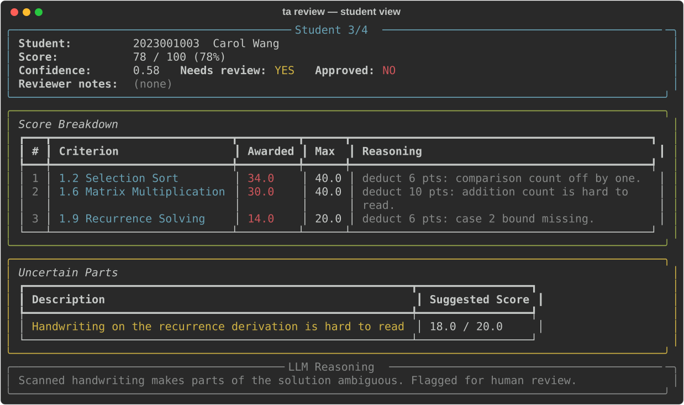

# Reviewing in the TUI

`ta review` walks through students one by one, shows the LLM's breakdown and
reasoning, and lets you approve, override, or edit scores without touching
Excel.

```bash
# Only students flagged for review (low confidence or uncertain parts)
uv run python main.py review --needs-review

# Everyone, including already-approved students
uv run python main.py review --all

# Auto-approve perfect scores, then review the rest
uv run python main.py review --auto-approve --needs-review

# Try it with sample data — no login, no API key, nothing is submitted
uv run python main.py review --demo
```



## Key bindings

| Key | Action | Stays on the student |
|---|---|---|
| `a` / `approve` | Approve and advance to the next student | No |
| `e` / `edit` | Edit individual criterion scores | Yes |
| `n` / `notes` | Add or edit reviewer notes | Yes |
| `ov` / `override` | Set an override score | Yes |
| `o` / `open` | Open the submission file with the system viewer | Yes |
| `r` / `rubric` | Open the rubric file | Yes |
| `s` / `skip` | Skip without approving, advance | No |
| `b` / `back` | Go back to the previous student | No |
| `q` / `quit` | Quit (asks to save if anything changed) | — |

Approving a non-perfect score requires reviewer notes, matching the
`ta approve` command-line behavior.

## Layout notes

- On terminals narrower than 100 columns, the reasoning text is folded under
  each criterion instead of using a separate column, so nothing is cut off.
- Long reasoning and descriptions wrap instead of being truncated.
- Override scores are shown next to the struck-through LLM score.

## Regenerating the preview image

`docs/tui-preview.svg` is generated from the same demo data:

```bash
uv run python scripts/render_tui_preview.py
```
